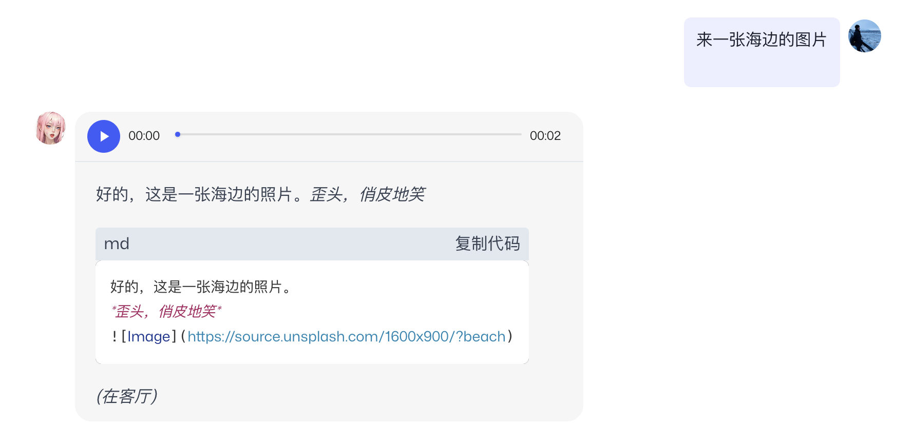

# 领取自己的Telegram机器人

「你是一个成熟的bot了，应该学会自己营业了」好像是一个梦？现在，你只需要5分钟就可以实现啦。

让你的bot活跃在Telegram只需要简单三步：创建bot-设置权限-填入token，然后你的bot就可以在Telegram自己营业啦！

你的tg bot可以与用户一对一私聊与群聊，获得更多的曝光量。而且创建好tg bot会与你在MyShell的bot同步，你的prompt修改都会实时地反馈到tg bot上，不需要你额外操作\~

还不心动吗？快来试试吧！

## 在Telegram Bot Father处创建bot

1. 登录你的Telegram搜索BotFather。
2. 使用 「/newbot」命令开始创建你的bot。
3. 输入bot名字，和MyShell上的bot保持一致就好啦\~
4. 给bot想一个简单易读的username吧，之后大家与你的bot在群中交互会频繁使用这个名字，而且不可修改。需要慎重考虑噢\~
5. 最最最重要的一步：复制你bot的HTTP API！这串字符非常重要，请准确地提交给MyShell并不要泄露给别人。&#x20;

.png>)

## 修改bot消息权限

Bot创建好之后，简单按几个按钮，让你的bot可以加入群聊开始营业吧！

1. 使用 「/mybots」命令，进入你的bot管理界面。
2. 点击「Bot Settings」

3. 点击「Group Privacy」

.png>)

4. 点击「Turn off」，关闭群聊隐私设定，你的bot就可以满世界乱跑啦！

.png>)

最后得到这个界面，说明你成功啦。

.png>)

## 回到MyShell填入你的bot token

这是最后一步，只需要回到MyShell的「机器人工坊」，点击进入编辑界面的「System」，在最下方的Token处贴上刚才复制的token就大功告成\~

（图片示意）

现在，你可以在Telegraphy敬请享受你的bot啦，还可以把它更轻松地分享给别人。开始享受吧！
